# Notes
What have I been reading up until now? 2024-05-09

## Table of Contents
##### [Mixture-of-Experts](#moe)
- [Outrageously Large Neural Networks](#outrageously-large-neural-networks)
- [Switch Transformers](#switch-transformers)
- [ST-MoE](#st-moe)
- [Empirical understanding of MoE](#towards-an-empirical-understanding-of-moe)
- [Hash Layers](#hash-layers-for-large-sparse-models)

##### [Mamba](#mamba)

- [Mamba](#mamba-linear-time-sequence-modeling)
- [Linear State-Space Layers](#linear-state-space-layers)
- [HiPPo Recurrent Memory](#hippo-recurrent-memory)
- [Legendre Memory Units](#legendre-memory-units)

##### [Tokenization](#tokenization)

- [ByT5](#byt5)
- [Tokenizer Choices](#tokenizer-choices-for-llm-training)
- [SaGE](#sage---incorporating-context-into-subword-vocabularies)
- [CANINE]()

##### [Compression](#compression)

- [Lossless Unicode Tamil Documents compression](#lossless-text-compression-for-unicode-tamil-documents)
- [Arabic Text Lossless Compression](#arabic-text-lossless-compression-by-characters-encoding)
- [Unishox](#unishox---a-hybrid-encoder-for-short-unicode-strings)

##### [Benchmarks](#benchmarks)

- [GSM-Plus](#gsm-plus)

## MoE
### Outrageously Large Neural Networks
The Sparsely-Gated Mixture-of-Experts Layer
[Link to pdf](https://arxiv.org/abs/1701.06538)

#### Summary

Introduction of a new component: the sparsely-gated MoE

**Key take away:**
Rather than applying the same parameters to all inputs, sparse expert networks dynamically select which parameters to use for each input

This gatting function $G(x)$ selects two experts to perform computations on $x$. And $E_{i}(x)$ is the $i$-th experts output

We note that:

$$y = \sum_{i=1}^{n} G(x)_{i} E_{i}(x)$$

##### The Gating Network

Different types of gating:

- **Softwax**: $G_{\sigma}(x) = Softmax(x \cdot W_{g})$ ($W_{g}$ is a trainable weight matrix)

- **Noisy Top-K**: Adding a tunabe Gaussian noise matrix to only keep the top k values and set the rest to $- \infty$ st:
$$G(x) = Softmax(KeepTopK(H(x), k)) \\
H(x)_{i}=(x\cdot W_{g})_{i} + StdNormal() \cdot Softplus((x \cdot W_{noise})_{i}) \\
KeepTopK(v, k)_{i} = \begin{cases}
  v_{i}, & \text{if $v_{i}$ is in the top k elements of v}, \\
  - \infty, & \text{otherwise}.
\end{cases}$$

##### Balancing Expert Utilization
Using an importance matrix tied to the gated matrix weights to not oversaturate expert

##### Dataset:
One Billion Word Benchmark

### Switch Transformers
Scaling to Trillion Parameter Models with Simple and Efficient Sparsity
[Link to pdf](https://arxiv.org/abs/2101.03961)

Simplify routing. Switch transformer encoder block replaces FFN layer

Instead of routing to 2 experts as MoE usually do, they route to only one expert.

##### Load Balancing

Auxiliary load balacing loss helps distribute the tokens better across different experts. 
Before: Done with separate load-balacing and importance weighting losses

Using Mesh-TensorFlow

Dataset:
C4 (~7TB): https://www.tensorflow.org/datasets/catalog/c4

### ST-MoE
DESIGNING STABLE AND TRANSFERABLE SPARSE  EXPERT MODELS
[Link to pdf](https://arxiv.org/abs/2202.08906)

#### Summary

Setting the number of experts:
Depends on hardware specifically, memory transfer vs efficiency trade off.
In sparse models increasing number of experts decreases the compute-to-memory ratio.
For TPU's they recommend one expert (or less) per core.

Choosing routing algorithm:
Test on top-1 2 and n routing algorithms

##### Conclusions:
Increasing CF improves quality.
Small gains of top-(n+1) over top-n given **fixed capacity factor**

Router-z-loss that resolves instability issues

Dense FFN immediately before and after each sparse layer improves quality.

Batch Prioritzied Routing (BPR) worked on. Gives a global view of all tokens to determine
which tokens should be dropped instead of left-to-right ordering.
Works by looking at all N tokens getting sent to Expert $i$ and then only routing the $M$
ones with the highest probabilities from the router.

### Towards an empirical understanding of MoE
[Link to pdf](https://arxiv.org/html/2402.13089v1)
#### Set ups

1. [Top-K](#outrageously-large-neural-networks) or [Top-1](#switch-transformers) routing
2. [Expert Specialization](#st-moe) what do each expert specialize on? Found mostly syntactic
specialization.

#### Experiments

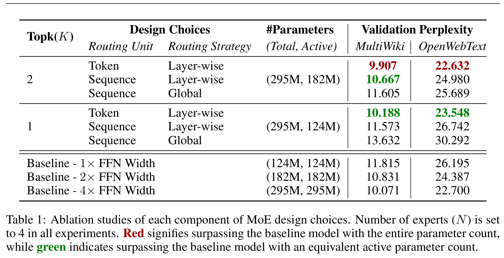

##### 

### Hash Layers For Large Sparse Models

[Link to pdf](https://arxiv.org/abs/2106.04426)

Investigating if non-parametric models can approach learned models

Outperforms Switch Transformers and BASE layers.

Note: This is a good sign as it tokenization might prove to not be the most optimal
solution if non-parametric alternatives work they could prove to also outperform
at a byte level too.

Background
Let us first introduce the Mixture-of-Experts setting where we apply our hash-based routing strategy.
We use the same setting as where a feedforward network (FFN) in a Transformer is
replaced by its MoE version. Given a tokenized input sequence ${x_1 , x_2 , . . . , x_T }$ of $T$ tokens, a
representation for each token is computed in parallel by a standard Transformer
$$h_1 , h_2 , . . . , h_T = TRANSFORMER (x_1 , x_2 , . . . , x_T ).$$
The Transformer consists of L layers that computes final hidden states for each token, and each layer
is composed of self-attention and FFN sublayers, where FFNs are two-layer fully connected networks
$$h̄_{l}^{t} = SelfAttn(h_{t}^{l-1}) \\
h_{l}^{t} = FFN(h̄_{l}^{t})$$
(2)
Here we omit skip-connections and normalization for brevity. We can then replace one or more of the
FFN sublayers with expert modules. Replacing the FNN at layer l with K expert FFNs, their output
is then mixed with some gating function $g(·)$:
$$h_{l}^{t} = FFN(h̄_{l}^{t}) → h_{l}^{t} = \sum_{i=1}^{K} g_i (h_{l}^{t}) FFN_i (h_{l}^{t}), t = 1, . . . , T,$$

where importantly each token is routed to a different mixture of experts, as the gating function
depends on the token’s specific hidden state h̄lt .
Sparse MoE methods assume gating values gi are often zero, so only a few experts need to be
computed for better efficiency. As expert FFNs do not share parameters, the number of parameters
increases with K while the amount of computations per input token stays the same if the MoE FFN
only routes to a single expert, and computation of gi is cheap. While this allows training of large
capacity models with small compute budget, optimizing gi in the sparse setting can be tricky.

#### Hash functions used

Random Hash,
Balanced hash:
Bigram Hash: Uses previous and next token (This could be interesing in the relation between different bytes)
Previos Token Hash similar to Bigram but only previous token
Position hash: Based on position of token in sequence
Oracle Future Hash: based on output token
Clustered Hashes: Similar tokens may want to route to the same expert. (I don't think this one will be necessarily that helpful)
Dispersed Hashes: Opposite to clustered hashes. (Could be interesting too)

#### MultiHash Layers

Best deploying multiple hashes give better allocations in many contexts.

We consider such schemes in the context of sparse routing. Let us
assume we are given N different hashing functions, and for a given input token x we compute these
hashes, denoted as $k_m = hash_m (x), m=1,...,N$ Assuming the usual expert FFN is a function

Use hashing to select the parameters we are going to use for each segment, and then
concatenate them together. The advantage is that we are now no longer reliant on the quality of a
single hash function, but have multiple chances to produce good quality partitions. This perhaps can
also be seen as analogous to the multi-head attention process already used in Transformers.

Datasets:
Pushshift.io Reddit
RoBERTa+cc100en Data
Wikitext-103
Downstream BST tasks

## Mamba

### Mamba: Linear Time Sequence Modeling
[Link to pdf](https://arxiv.org/abs/2312.00752)

Improvements:
- Letting SSM paramenters be functions of the input addresses their 
weakness with discrete modalities, this permits the model to 
selectively propagate or forget info along the sequence length 
dim depending on the current token. 
The ability to efficiently select data in an input-dependent manner
(i.e. focus on or ignore particular inputs)

- Prior SSM models were time- and input- invariant in order to be
computationally efficient. We overcome this with a hardware-aware 
algorithm that computes the model recurrently with a scan instead 
of convolution, but does not materialize the expanded state in order 
to avoid IO access between different levels of the GPU memory hierarchy.

### Linear State-Space Layers:
[Link to pdf](https://arxiv.org/abs/2110.13985)

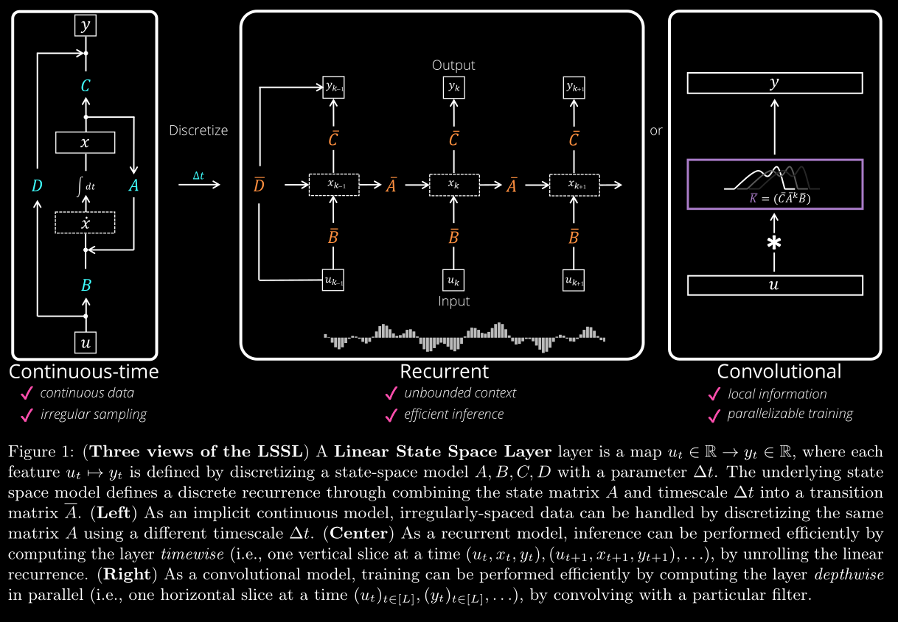
**Linear State-Space Layer (LSSL)**:

Is a simple sequence model that maps a 1-dim function or sequence $u(t) \to y(t)$
through an implicit state $x(t)$ by simulating a linear continuous-time state-space
representation in discrete-time
$$\dot x(t) = Ax(t) + B(t) \qquad (1) \\ y(t) = Cx(t) + Du(t) \qquad (2)$$
where $A$ controls the evolutions of the system and $B,C,D$ are projection parameters.

#### Properties:

- LSSLs can be a **linear recurrence** if we specify a step-size $\Delta t$ and by applying
a [discretization](#discretization).
This has many perks such as being able to be simulated during inference as a recurrent
model with constant memory and computation per time step.
- LSSLs can be represented by a continous convolution as stated by the [discretization](#discretization). Which in it's discrete-time version 
can be **parallelized**.
- LSSLs are differential equations. Thus have a **continuous-time** interpretation.

#### Tradeoffs and solution:

**Issues** 
1. They inherit the limitations of both RNNs and CNNS on long sequences
2. The choice of A and $Delta t$ is crucial for the model to work well. 

**Solutions** 

These issues are addressed by chosing A from a class of structured matrices that generalize
prior work on continuous-time memory and mathematically capture long dependencies
with respect to a learnable family of measures. More info on [HiPPo Recurrent Memory](#hippo-recurrent-memory)
and [Continuous-Time Memory](#continuous-time-memory)

#### Discretization

Using the **generalized bilinear transform (GBT)** specialized in linear ODEs of shape (1)
$$x(t + \Delta t) \\
= (I - \alpha \Delta t \cdot A)^{-1} (I + (1 − \alpha) \Delta t \cdot A)x(t) \qquad (3)\\ 
+ \Delta t(I − \alpha \Delta t \cdot A)^{−1} B \cdot u(t))$$
Cases: 
1. $\alpha = 0$  GBT becomes a classic *Euler method* 
2. $\alpha = 1$  GBT becomes a *backward Euler method*
3. $\alpha = \frac{1}{2}$ GBT becomes a *bilinear method* which preserves stability

For $\alpha = \frac{1}{2}$ we can define $\bar A$ and $\bar B$ to be the matrices on (3)

Such that the **discrete-time** state-space model becomes
$$x_t = \bar{A}x_{t-1} + \bar{B}u_t \qquad (4) \\ y_t = Cx_t + Du_t \qquad (5)$$

#### Continuous-Time Memory
For more information on HiPPo go to my summary of the paper [HiPPo](#hippo-recurrent-memory)

For an input function $u(t)$, a fixed probability measure $w(t)$, and a sequence of $N$ basis
functions such as polynomials. At every time t, we can project the history of $u$ onto this basis
yielding a vector of coefficients $x(t) \in {\R}^N$. This mapping can be done using the
**High-Order Polynomial Projection Operator (HiPPO)**.
In special cases such as the uniform measure $w = I\{[0, 1]\}$ and the
exponentially-decaying measure $w(t) = exp(−t)$ [HiPPo](#hippo-recurrent-memory) showed that $x(t)$ satisfies a differential equation
(1) and derived closed forms for the matrix A.
The definition can be found [here](#hippo-abstraction)

#### Views of LSSLs
Given a fixed state space representation A,B,C, and D
1. Continuous-Time:
$$\dot x(t) = Ax(t) + B(t) \qquad (1) \\ y(t) = Cx(t) + Du(t) \qquad (2)$$
2. Recurrence:
The recurrent state $x_{t-1} \in {\R}^{H X N}$ carries the context of all inputs before $t$.  
Thus the output $y_t$ and current state $x_t$ are computed using: 
$$x_t = \bar{A}x_t + \bar{B}u_t \qquad (4) \\ y_t = Cx_t + Du_t \qquad (5)$$

3. Convolution: Let initial state $x_{-1} = 0$ then (4) + (5) yields
$$y_k = C{(\bar A)}^k \bar B u_0 + C{(\bar A)}_{k-1}\bar B u_1 + \dots + C{(\bar AB)}u_{k-1} + \bar B u_k + D u_k \qquad (6)$$
Then $y$ is simply the (non-circular) convolution $y = K_L(A,B,C) * u + Du$, where
$$K_L(A,B,C) = (C A^i B)_{i \in [L]} \in \R^L = (CB, CAB,\dots, CA^{L-1}B) \qquad (7)$$
The entire output $y \in \R^{HxL} can be computed at once by a convolution, which can be efficiently implemented with three FFTs.

##### Computational Bottlenecks

1. Recurrence view is a **matrix-vector-multiplication (MVM)** of the discretized $\bar A$
2. Convolutional view is computing a Krylov function $K_L$

For both views, learning the parameters $\bar A$ and $\Delta t$ 
requires recomputing a MVM and a Krylov function for $\bar A$ over and over. Which is computationally inefficient.

Corollary 4.1. For $w$ corresponding to the classical OPs, hippo($w$) is 3-quasiseparable.

They show that the same restriction of $A$ to the class of quasiseparable (Corollary 4.1), which gives an LSSL the ability to theoretically remember long dependencies, simultaneously grants it computational efficiency. 

First of all, it is known that quasiseparable matrices have efficient (linear-time) MVM. We show that they also have fast Krylov functions, allowing efficient training with convolutions. 

##### Limitations

The fast Krylov algorithm is sophisticated and was not implemented in the first version of this work. A follow-up to this paper found that it is not numerically stable and thus not usable on hardware. Thus the algorithmic contributions serves the purpose of a proof-of-concept that fast algorithms for the LSSL do exist in other computation models (i.e., arithmetic operations instead of floating point operations), and leave an open question as to whether fast, numerically stable, and practical algorithms for the LSSL exist. 

### HiPPO Recurrent Memory
[Link to pdf](https://arxiv.org/abs/2008.07669)

RNN have a hard time capturing long-term dependencies resulting in vanishing gradients.
This has been addressed in Legendre Memory Units (LMU) and Fourier Recurrent Units. But 
these solutions still still lack theoretical guarantees on gradient bounds.

HiPPO tries to able to address dependencies of arbitrary length **without** priors on the timescale.

Using **orthogonal polynomials** a natural basis emerges which you can update with an optimal
polynomial approximation as the input sequence is being revealed through time.

#### General approach

Let $f(x) \in \R \text{ on } t \geq 0$ be the input function. We will project the space of functions 
that form the cumulative history $f_{\leq t}:= f(x) |_{x \leq t}$ at every time $t \geq 0$ for every
time $t$. We project this space of functions onto a subspace of bounded dimensions. This compressed version
becomes the representation of the history of the input at time $t$.

We now need:
1. Properly quantify the approximations onto the subspace.
2. Finding a suitable subspace.

#### Function Approximation 

For a given function $f(x)$ and a probability measure $\mu \text{ on } [0, \infty )$, any space of square
integrable functions with inner product $\langle f, g \rangle_{\mu} = \int_{0}^{\infty} f(x)g(x) d\mu(x)$ is a Hilbert space.

Any $N$-dim subspace of this function space is suitable for approximations.

Let $G$ be such space we seek some $g^{(t)} \in G$ that minimizes $\|f_{\leq t} - g^{(t)}\|_{\mu^{(t)}}$

Here, $\mu^{(t)}$ is the measure that controls the importance of the parts in the inputs domain.

This approximation is represented by $N$ coeffs of its expansion in any basis of $G$.

#### HiPPO abstraction

Given a time-varying measure family $\mu^{(t)} \text{ on } ( - \infty, t]$, and $N$-dim subspace $G$ of polynomials and a function $f: \R_{\leq 0} \to \R$, we have that $proj_t \text{ and } coef_t$ define HiPPO to:
1. Project $f$ onto a polynomial $g^{(t)} \in G$ that minimizes the approximation error $\|f_{\leq t} - g^{(t)}\|_{\mu^{(t)}}$
2. We then compute the coefficients with the following mapping: $coef_t : G \to \R^N$ such that $coef_t(g^{(t)}) = c(t) \in \R^N$  

Thus $hippo(f)(t) = coef_t(proj_t(f))$ is the HiPPO abstraction of $f$ at time $t$. We also find that $c(t) = coef_t(proj_t(f))$
has the form of an ODE such that 
$$\frac{d}{dt} c(t) = A(t)c(t) + B(t)f(t)$$
for some matrices $A(t) \in \R^{N \times N} \text{ and } B(t) \in \R^{N \times 1}$

Discretizing this ODE we get a linear recurrence relation 
$$c_{t+1} = A_t c_t + B_t f_t$$

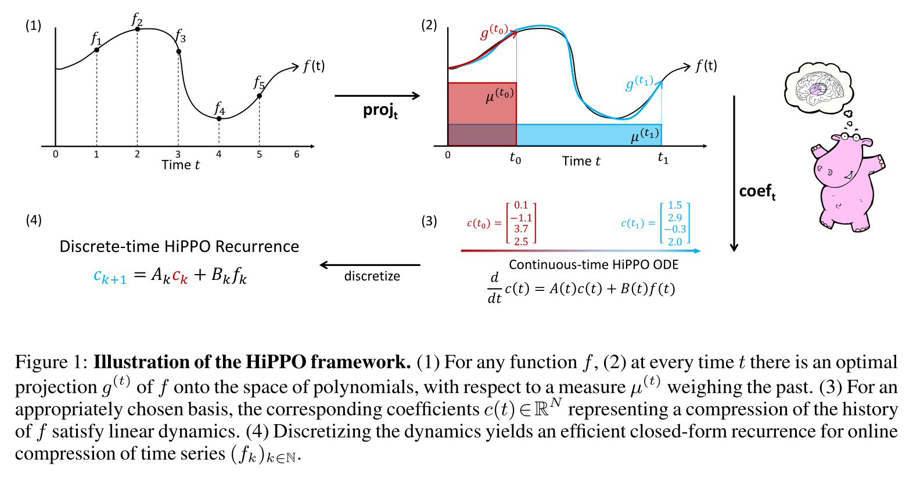

#### HiPPO recurrence: Continuous to Discrete Time with ODE discretization

The basic discretization as shown in the [LSSL](#discretization) paper. Is very dependent on the step size $\Delta t$
hyperparameter as it is incharge of performing the discrete update. The note that this 
is the reasons why this method is able to seamlessly handle timestamped data even with
missing values. Serving as a tool to outperform against typos and other human errors that
could appear in training data. 

#### HiPPO-LegS: Scaled measures for Timescale robustness

Scaled Legendre measures (LegS) assign uniform weights to all history $[0,t]: \mu_{(t) = frac{1}{t}\I_{[0,t]}}$

Giving us the following continuous and discrete time dynamics:

$$\frac{d}{dt} c(t) = - \frac{1}{t} Ac(t) + \frac{1}{t}Bf(t) \qquad (3)$$
$$c_{t+1} = (1 + \frac{A}{t} c_t) + \frac{1}{t} B f_t \qquad (4)$$
$$A_{nt} = \begin{cases} (2n+1)^{\frac{1}{2}} (2t+1)^{\frac{1}{2}}, & \text{if } n \geq t , \\
  n + 1 & \text{if } n = k,  \qquad B_n = (2n + 1)^{\frac{1}{2}} \\
  0 & \text{if } n \leq t 
\end{cases}$$

##### Advantages:
1. **Timescale robustness:** HiPPO-LegS doesn't take a timescale parameter and dialating the input $f$ doesn't change the approximation coefficients. 
As for any scalar $\alpha>0$, if $h(t)=f(\alpha t)$, then $hippo(h)(t)=hippo(f)(\alpha t)$. In other words, if $\gamma  :t\to \alpha t$ is any dilation function, then $hippo(f \odot \gamma)=hippo(f) \odot \gamma$
2. **Computational efficiency:** The main operation is matrix multiplication on discretized square matrix $A$ generally done in $O(n^2)$ can be done with fast multiplication algorithms (discretization can be done using [GBT](#discretization))
3. **Gradient flow:** Removes vanishing gradient problem
4. **Approximation error bound:**  The error rate of LegS decreases with the smoothness of the input. 

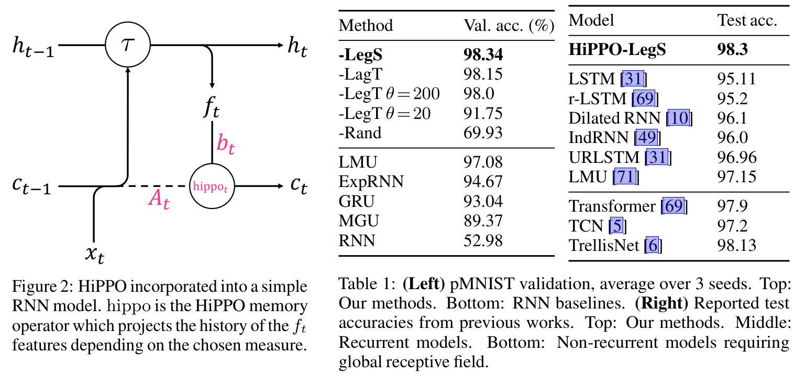
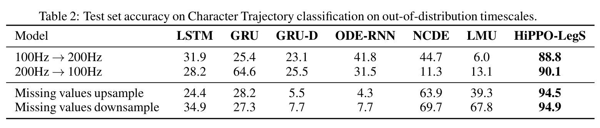
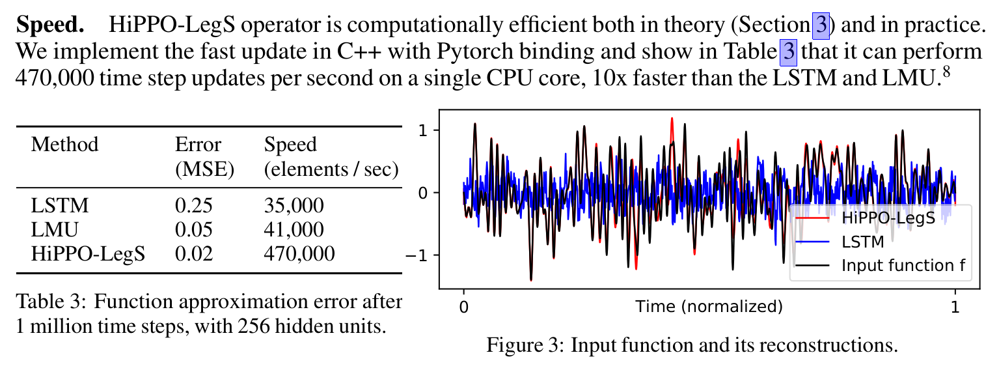

### Legendre Memory Units
[Link to pdf](http://papers.nips.cc/paper/9689-legendre-memory-units-continuous-time-representation-in-recurrent-neural-networks)

The paper aims to replicate the Neurological findings of Delay Network which observes how
the brain transmits spikes of information through synaptic connections to then filter them
and keep the signal going.

##### Delay Networks

Works on a mechanism of approximating the ideal delay line by converting it into a finite
set of ODE's integrated over time.

#### Memory Cell Dynamics

Orthogonalizes the continuous-time history of the input signal $u(t) \in \R$, across a
sliding window $\theta \in \R_{>0}$ The cell is derived from the linear transfer function 
for a continuous-time delay, $F(s)=e^{-s\theta}$, which is best-approximated by $d$ 
coupled ordinary differential equations (ODEs): 
$$ \theta \dot m(t) = Am(t) + Bu(t) \qquad (1) $$
where $m(t) \in \R^d$ is a state-vector with $d$ dimensions. The ideal state-space matrices,
$(A,B)$ are: 

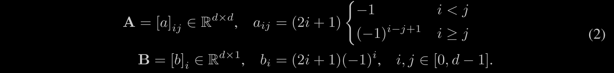

Importantly $m$ represents a sliding window of $u$ via the **Legendre polynomials** of up
to degree $d-1$.

$$
u(t - \theta ') \approx 
\sum_{i=0}^{d-1} P_i(\frac{\theta '}{\theta})m_i(t) ,
\quad 0 \leq \theta ' \leq \theta
\\
P_i(r) = (-1)^i \sum_{j=0}^{i} \binom{i}{j} \binom{i+j}{j} r^j \qquad (3)
$$

where $P_i$ is the **shifted** $i$-th Legendre polynomial.

**Important take away!** This decomposition allows $m$ to correspond to
computations across windows of length $\theta$ projected onto the $d$ 
orthogonal basis functions.

#### Discretization of LMU

We map these equations onto the memory of a recurrent neural network, $m(t) \in \R_d$, given some input $u(t) \in \R$, indexed at discrete moments in time, 
$t \in \N:$
$$
m(t) = \bar Am(t−1) + \bar Bu(t) \qquad (4)
$$
where $(\bar A, \bar B)$ are the discretized matrices provided by the ODE solver for some time-step $\Delta t$ relative to the window length $\theta$

**Error approximation** 

As $d$ increases so does it's memory capacity relative to frequency content. In particular, the approximation error in equation 3 scales as $O(\theta w/d)$, where $w$ is the frequency of the input $u$ that is to be committed to memory

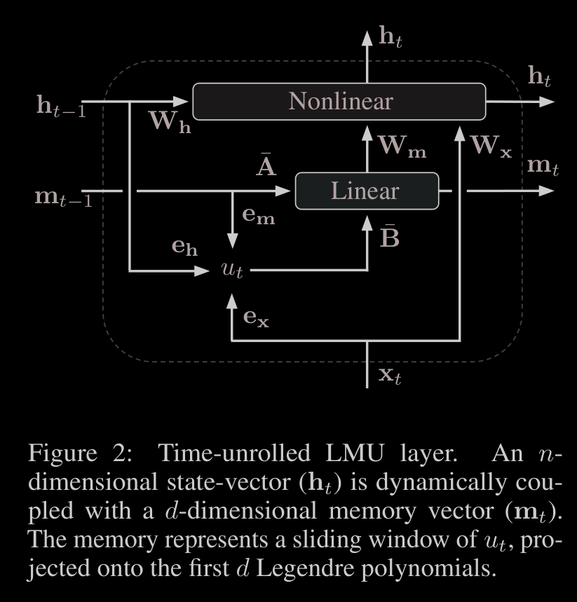

For input vector $x_t$, hidden state $h_t$, and memory state $m_t$
$$ u_t = {e_x}^T x_t + {e_h}^T h_{t-1} + {e_m}^T m_{t-1} \qquad (5)$$
where $e_x, e_h, e_m$ are learned encoding vectors. Intuitively, the 
kernels ($W$) learn to compute nonlinear functions across the memory,
while the encoders ($e$) learn to project the **relevant information** 
into the memory. The parameters of the memory $(\bar A,\bar B¯, \theta)$
may be trained to adapt their time-scales by backpropagating through the 
ODE solver, although we do not require this in our experiments.

#### LMU Results

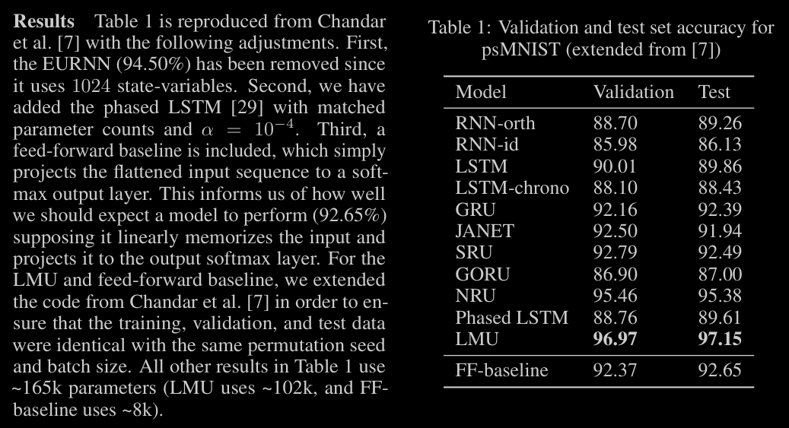

### Legendre Polynomials Examples

Let $V = \text{Polynomials on} [-1,1]$
Given polynomials: $x^2, x^3 -2x^2 +1, x^900$
$f \cdot g = \int_{-1}^{1} f(x)g(x)dx$
A Legendre Orthonormal basis $\{p_n\} of V, p_n (1) = 1$

Taking a standard basis for $V$ 
$\{1, x, x^2, x^3, x^4, \dots \}$

Doing the gram-schmidt process we get the following orthonormal basis

$p_0 (x) = 1$

To find $p_1 (x) = ?$ we have to find the projection of $x$ onto $p_0$ and subtract it from $x$.

$$\hat x = \frac{x \cdot p_0}{p_0 \cdot p_0} \\ = \frac{\int_{-1}^{1} x dx}{\int_{-1}^{1} 1 dx} = 0$$

$$x - \hat x = x$$

Thus $p_1 (x) = x$

**Note: if we find x to not be p_0(x)=1 we must normalize it to become 1** 
To find $p_2 (x) = ?$ we have to find the projection of $x^2$ onto $p_0$ and $p_1$ and subtract it from $x^2$.

$$\hat x^2 = (\frac{x^2 \cdot p_0}{p_0 \cdot p_0})(p_0) + (\frac{x^2 \cdot p_1}{p_1 \cdot p_1})p_1 \\
= \frac{\int_{-1}^{1} x^2 dx}{\int_{-1}^{1} 1 dx} + \frac{\int_{-1}^{1} x^3 dx}{\int_{-1}^{1} x^2 dx}x \\
= \frac{\frac{2}{3}}{2} + 0 = \frac{2}{3}$$
$$x^2 - \hat x^2 = x^2 - \frac{2}{3}$$

$$p_2 (x) = c(x^2 - \frac{2}{3})$$
$$p_2 (1) = \frac{2}{3}c = 1$$
$$c = \frac{3}{2}$$
$$p_2 (x) = \frac{3}{2}(x^2 - \frac{1}{3})$$

We therefore have the first 2 legendre polynomials. Which will be an 
ortho-normal basis for the space of polynomials on $[-1,1]$

### Orthogonal Polynomials
[Link to pdf](https://arxiv.org/pdf/1303.2825.pdf)

## Tokenization

### ByT5

[Link to pdf](https://arxiv.org/abs/2105.13626)

Tokenization on a byte level is performed by splitting the utf-8 encoding into one token per byte.

Notable tradeoffs between character and subword encoding include, parameter counts, training FLOPs, and 
inference speed. 

We have that the large vocabularies of word- or subword models often result in many parameters being devoted 
to the vocabulary matrix. In contrast, byte-level model by definition only requires 256 embeddings. This helps
mitigate the word representations from sparse vocabulary matrices, into dense network layers should allow the 
model to generalize more efficiently.

They also note that models with fixed vocabulary can complicate adaption to new languages and new terminolgy 
whereas by definition token-free models can process any text sequence.

##### Design of ByT5

They differ from previous work in that they (1) Train encoder-decoder models that extend to generative task, (2)
Their models work directly with UTF-8 bytes, (3) They explore the effect of model scale, training beyond 10b params

**Differences with mT5** 
1. Feed UTF-8 bytes straight into the model
2. Modify the "span corruption" pre-training objective. This task refers to a span of tokens in unlabeled data are replaced
with a single "sentinel" ID and the model must fill in the missing span. In their case, they found that it was sufficient
to resue the final 100 byte IDs. **Note:** While mT5 usesan average span of 3 subwords they decided to use a lenght of 20 bytes. 
3. The found best results in a "heavy" encoder in which the encoder was 3 times deeper that the decoder.

They adjust the ByT5 model hidden size ($d_{model}$) and feed-forward dimensionality ($d_{ff}$) to be parameter matched with mT5.
Due to the reduction in total parameter count. This is done following the Scaling LLM paper

**Note:** Mapping the input token to its corresponding vector representation in the vocabulary matrix is essentially "free" 
in terms of FLOPs since it can be implemented by addressing a particular row in memory. 

Byte-level models trained on the same number of tokens as a word or subword-level model will have been trained on less text data.

**Compression Rate:** In comparison to the mT5 SentecePiece tokenization, they measured the compression rate of UTF-8 bytes to 
tokens in each language split of the mC4 corpus used in pre-training. While the ratio ranges from 2.5 in Maltese to 9.0 in Khmer.
As a whole, the overall compression rate is 4.1 bytes per SentecePiece token. This is a x4 increase to the sequence length which 
they see as a benefit as the model get more compute to spend encoding a given piece of text.

but given a fixed input sequence length, and number of training steps, the model will be exposed to roughly x4 less actual text during
pre-training.

###### What measures they use?
1. Parameter count: an simple and easy-to-measure quantity that directly relates to the amount of memory required to use a model. 
2. Inference Time: real world measure of models computational cost 
3. Pre-training efficiency:

Using the benchmarks: GLUE, SuperGLUE, GEM-XSum, XNLI, TweetQA, DROP, and a decreased Dakshina task.

###### Results

Better performance in smaller models (up to 1B parameters) for GLUE and SuperGLUE 
Perhaps due to lock up in vocabulary related matrices for mT5.

For GEM-XSum, TweetQA, and DROP ByT5 outperforms in all model sizes. 
Getting close to best model in GEM-XSum (15.3 vs 17.0)

For XNLI tasks:
ByT5 outperforms in smaller model sizes but achieves mixed results in large models (above 1B params)

For Dakshina and SIGMORPHON 2000
ByT5 outperforms in all classes.

**Synthetic Noise:** 
They used multiple noising schemes on the XNLI benchmark and outperformed in all schemes.
Such as DROP ( dropping a character), Repetition, Antspeak (each character is capitalized and padded with spaces), Uppercase
(just upper case), Random Case (random variation of upper and lower case).

In the encoder/ decoder balance they find that a "heavy decoder" out performs other balances. 

**Speed comparison:** ByT5 requires ~1.2x more operations, resulting in ~0.75x as many sequences per second.
On longer input sequences like GEM-XSum the slowdown is more pronounced.

When holding batch size constant at a fixed number of tokens, they show that ByT5 typically takes more fine-tunning steps than
mT5 to reach optimal performance. For tasks that favour byte-level representations, ByT5 achieves peak performance in 2.5x less 
steps (eg. Dakshina)

### Tokenizer Choices for LLM Training 

[Link to pdf](https://arxiv.org/abs/2310.08754)

Use of tokenizers especially the difference between monolingual and multilingual tokenizers has a significant impact on the performance of LLMs

####  Intrisic Evaluation

Evaluation of tokeinzer with regards to the dataset. Measuring fertility (number of tokens per word) and parity (how fairly a tokenizer treats equivalent sentences in different languages).

#### Extrinsic Evaluation

Downstream evaluations like ARC-Easy, HellaSwag and others were used to compare these models.

#### Findings

SentecePiece BPE and HuggingFace BPE have different tokenization encoding schemes. 

Low overlap between HF BPE and SP BPE might be due to different configurations and pre-processing steps.

For MultiLingual tokenizers, the overlap is low due to the larger thesaurus in multilingual documents. Note: multilingual has lower overlap.

Using pre-trained GPT-2 tokenizer  to pre-train and fine-tune multilingual models should be omitted due to very poor performance.

Best performing tokenizer on average accross all tasks had a vocabulary size of 33k.

**They maintained the same hyperparameter across all tokenizers to ensure a fair comparison.**

#### Computational Cost

Lower fertility scores and, therefore, smaller vocabularies lead to faster training and inference times.
Increasing the vocabulary size from 50k to larger vocabulary sizers increases the computational costs in all cases.
Indicating lower fertility of larger vocabularies doesn't compensate for larger vocabulary size computational cost.

### SaGE - Incorporating Context into Subword Vocabularies

[Link to pdf](https://arxiv.org/abs/2210.07095)

### CANINE - Efficient Tokenization-Free Encoder

[Link to pdf](https://arxiv.org/abs/2103.06874)

Canine offers and alternative tokenization method that doens't require tokenization

They offer:
1. Full character-level loss that autoregresively predicts characters in masked spans.
2. Vocabulary based los that predicts the identities of masked subword tokens. **Note:** this tokenization
is only used for pre-training loss. tokens are never input to the encoder, the tokenizer and the vocabulary
can be discarded after pre-training.

##### How their model works.

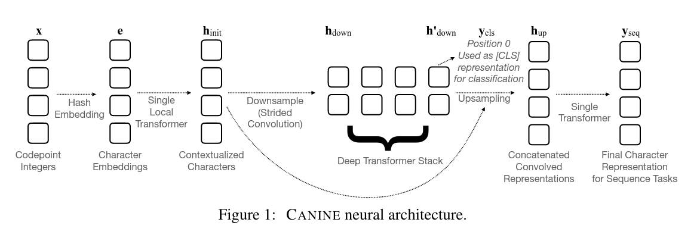

**1. Pre-processing:** Transform UTF-8 chars into their codepoint. 

**2. Character Hash-embeddings:** Using multiple hash functions they encode each character yielding 
a concatenation of their hash values. 
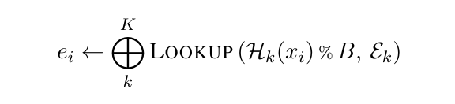
They note that while individual hash functions are subject to hash collisions, the overall effect is 
minimal.

**2.1. Optional:** Use of a vocabulary free n.grams 

Where we redefine the embeddings $e_i$ above to include the n-grams characters
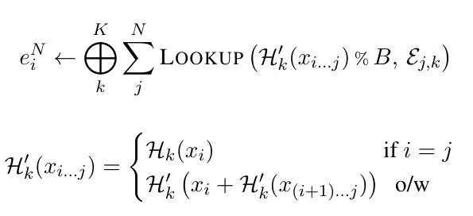

**3. Downsampling:** To make CANINE efficient they use a **single** layer block-wise local attention
transformer. To perform self attention only within each block of a predefined size. Then use a strided convolution
to reduce the number of sequence positions to be similar to that of a word piece model.

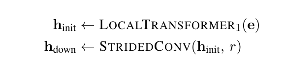

**4. Regular transformer stack**  Here any sequence-to-sequence model can be used.

**5. Upsampling:**

## Compression

### Lossless Text Compression For Unicode Tamil Documents

[Link to pdf](https://ictactjournals.in/paper/IJSC_Vol_8_Iss_2_Paper_7_1635_1640.pdf)

#### Summary

In this paper the authors find a clever mapping from Tamil Unicode characters to ASCII encoding.

Basic Tamil has a total of 247 characters available. While some vowels require the basic shape of
the consonant to be altered in a way that is specific to that vowel. Other characters are written
by adding vowel specific suffixes to consonants.

Compression of the Tamil texts are done by replacing a single character by ASCII characters. This is
due to the encoding of UTF-8 where ASCII characters (being the first in the UTF-8 encoding) on take up
1 byte (256 bits). Where as Tamil range from U+0B80 to U+0BFF, this means in UTF-8 encoding these characters
take up 2 bytes instead. 

Mapping from Tamil to ASCII therefore allows for a 50 % compression. We note that Tamil characters on text
are a combination of different Unicode characters. Thus further compression occurs in this process.

The study goes to show results of this compression in detail.

### Arabic Text Lossless Compression by Characters Encoding

[Link to pdf](https://www.researchgate.net/publication/335805490_Arabic_Text_Lossless_Compression_by_Characters_Encoding)

#### Summary

In a similar fashion to the previous paper, this study aims to map the Arabic characters to ASCII characters to reduce it's
Unicode character size.

### Unishox - A hybrid encoder for Short Unicode Strings

[Link to pdf](https://vixra.org/abs/2109.0113)

## Benchmarks

### GSM-Plus

[Link to pdf](https://arxiv.org/abs/2402.19255)

#### Summary

Data leaks of benchmarks are a big concern when evaluating models as the benchmark could have been leaked into the dataset and therefore compromising the results.

GSM-Plus seeks to address this by introducing various changes to the GSM benchmark to make it more secure.
They then compared tests between the original GSM and the GSM-Plus to see if the changes had any effect on the results.

###### 1. Numerical Variation:
Introduce changes to the numerical values in the dataset to make it harder to memorize the dataset.

Very little fluctuation is seen in the results of the GSM-Plus compared to the original GSM.

###### 2. Arithmetic Variation

Introduce changes to the arithmetic operations in the dataset to make it harder to memorize the dataset.

We see an accuracy drop of around 40% . This could be due to issues with backward reasoning.

###### 3. Problem Understanding

Rephrasing a question.

All models have robust performance when answering the rephrased question.

###### 4. Distraction Insertion

Adding useless information that is not relevant but is still topic related.

We see all models are capable of resisting the distraction insertion.

###### 5. Critical Thinking

Focuses on the models ability to question or doubt the wether the questions lacks the necesary information to be answered.

We see a drop of nearly 100% in all models when essential statements are removed.

#### Prompt Enhancements 

Using **Chain-of-thought**, **Program-of-thought**, **Compositional-prompting**. Results show improvements in the different tests.

Specifically, when using Compositional-prompting in tandem with self-consistency (SC) technique. 

